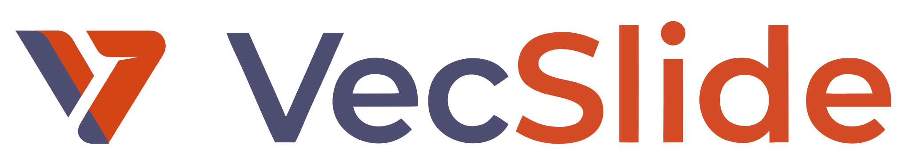

<p align="center">
  
</p>

# VecSlide

Vector presentation format with synchronized audio.

A `.vecslide` file is a ZIP container that holds SVG slides and an Opus audio track, synchronized through a YAML manifest. The final viewer is a single self-contained HTML file, playable in any browser with no external dependencies.

## Why VecSlide

A 1-hour university lecture in 4K:

| | 4K MP4 Video | VecSlide |
|---|---|---|
| **Total size** | ~930 MB | ~13 MB |
| **Visual quality** | Compression artifacts | Perfect at any resolution |
| **Text** | Baked into pixels | Selectable, copyable, searchable |
| **Required bandwidth** | 15-20 Mbps streaming | Instant download, works offline |
| **Accessibility** | None | Screen reader, clipboard copy |

The secret: slides are SVG code (XML text), not raster images. Whether the screen is 1080p or 8K, the file size does not change.

## How it works

```
                    ┌─────────────────────────────────┐
                    │         lesson.vecslide          │
                    │            (ZIP file)            │
                    ├─────────────────────────────────┤
                    │  manifest.yaml                   │
                    │  audio/voice.opus                │
                    │  vector_assets/01_title.svg      │
                    │  vector_assets/02_content.svg    │
                    │  vector_assets/03_conclusion.svg │
                    └─────────────────────────────────┘
                                   │
                        vecslide compile
                                   │
                                   ▼
                    ┌─────────────────────────────────┐
                    │         lesson.html              │
                    │   (single self-contained file)   │
                    │                                  │
                    │   - Inline SVG in the DOM        │
                    │   - Opus audio in Base64          │
                    │   - Manifest as JSON              │
                    │   - Integrated player JS/CSS      │
                    │                                  │
                    │   Double-click → opens in the     │
                    │   browser, works offline          │
                    └─────────────────────────────────┘
```

## The `.vecslide` format

A `.vecslide` file is a renamed ZIP archive. It can be extracted and inspected with any ZIP tool.

### Internal structure

```
lesson.vecslide (ZIP)
├── manifest.yaml            # Timeline, metadata, animations
├── audio/
│   └── voice.opus           # Audio track (Opus VBR + DTX)
└── vector_assets/
    ├── 01_title.svg
    ├── 02_content.svg
    └── 03_conclusion.svg
```

### Manifest

The `manifest.yaml` is the heart of the format. It defines the slide sequence, entry timestamps synchronized with audio, in-slide animations, and pointer data.

```yaml
metadata:
  title: "Lesson 1: Cell Anatomy"
  author: "Prof. Smith"
  aspect_ratio: "16:9"
  audio_track: "audio/voice.opus"
  total_duration_ms: 3600000

slides:
  - id: "slide_01_title"
    file: "vector_assets/01_title.svg"
    time_start: 0
    transition_in: "fade-in"

  - id: "slide_02_mitochondrion"
    file: "vector_assets/02_mitochondrion.svg"
    time_start: 15500
    transition_in: "slide-left"
    animations:
      - element_id: "bullet-1"
        time_trigger: 18200
        effect: "fade-in"
        duration: 400
      - element_id: "red-arrow"
        time_trigger: 25000
        effect: "draw-path"
        duration: 800
    pointer_trail:
      - time: 20000
        points: "100,200 105,198 112,195 130,180"
        fade_duration: 1500

annotations:  # visible only in the editor, ignored by the viewer
  - slide_id: "slide_02_mitochondrion"
    type: "highlight"
    rect: { x: 100, y: 200, w: 300, h: 50 }
    color: "#ffeb3b80"
  - slide_id: "slide_02_mitochondrion"
    type: "comment"
    position: { x: 400, y: 100 }
    text: "Add practical example"

transcript:  # at the bottom of the manifest, synchronized with audio or standalone
  mode: "synchronized"  # "synchronized" | "standalone"
  language: "en"
  segments:
    - start_ms: 0
      end_ms: 4500
      text: "Welcome to the cell anatomy lecture"
      slide_ref: "slide_01_title"
    - start_ms: 4500
      end_ms: 12000
      text: "Today we will study the mitochondrion..."
      slide_ref: "slide_02_mitochondrion"
```

### Audio

- Codec: **Opus** in `.ogg` container
- Encoding: **VBR** (Variable Bitrate) + **speech** mode + **DTX** flag (Discontinuous Transmission)
- DTX zero-weights silences (pauses between slides, waits, breaths)
- Quality equivalent to a podcast, ~12 MB/hour
- Browser support: ~97% globally (including Safari from iOS 18.4+)

### Compression in the ZIP

- **SVG and YAML:** compressed with Deflate (~75-80% reduction, they are repetitive XML text)
- **Opus audio:** archived with Store method (no additional compression, it is already compressed)

> **Note:** Deflate compression happens only in the `.vecslide` path (implemented in
> `vecslide-core/src/pack.rs`, used by the CLI). The **Export HTML** path of the authoring tool
> (`vecslide-app`) produces a self-contained HTML file without additional compression: SVGs are
> raw text in `<script type="text/xml">` blocks and audio is Base64-encoded. The resulting
> file is larger than an equivalent `.vecslide`, but it opens with a double-click with no
> supporting tools required.

## The Viewer

The viewer is a pure HTML5 file, generated by the compiler. It contains no external libraries, frameworks, or dependencies.

### Two playback modes

The viewer automatically detects whether the presentation contains an audio track:

| | With audio (**Audio** mode) | Without audio (**Static** mode) |
|---|---|---|
| **Master clock** | `<audio>` element | None — manual navigation |
| **Slide advancement** | Automatic, synchronized with audio | Manual (arrows, click, swipe) |
| **Captions** | Direct lookup on `transcript.segments` | Shown by the "Read aloud" function |
| **TTS** | Not needed (real voice is present) | Web Speech API (`speechSynthesis`) |

### Audio mode: audio is the master clock

Every visual element is driven by the audio position. A `requestAnimationFrame` loop reads `audio.currentTime` 60 times per second and determines:
- which slide to display
- the state of each in-slide animation
- the position of the pointer trail

If the user pauses, everything freezes. If they skip forward by 5 minutes, everything updates instantly to the correct frame.

### Navigation (Audio mode)

| Key | Action |
|-------|--------|
| `→` | Jump to next event (slide or animation) |
| `←` | Jump to previous event |
| `Space` | Play / Pause |
| Scrub on progress bar | Jump to any point in the presentation |

### Navigation (Static mode)

| Key | Action |
|-------|--------|
| `→` | Next slide |
| `←` | Previous slide |
| `Space` | Start TTS (if text is present) / otherwise next slide |
| `T` | Start / stop TTS reading |
| `F` | Full screen |
| `?` | Show keyboard shortcuts |

### Read aloud (TTS)

In static mode, if the transcript contains text, a button appears in the controls bar. The function uses the Web Speech API (`speechSynthesis`), which:

- works **offline** — no external server calls
- is supported by **~97% of browsers** (Chrome, Edge, Safari, Firefox)
- reads each transcript segment using the language set in the manifest (`transcript.language`)
- automatically advances to the correct slide following `slide_ref`
- shows the current segment's caption during reading

Controls during reading: click the button / `Space` for pause and resume, arrows / swipe to stop and navigate manually.

### Double buffering

To avoid lag in transitions, the viewer maintains two DOM containers:
1. **Current:** the visible slide
2. **Next:** the next slide, pre-injected ~3 seconds earlier into the DOM with `visibility: hidden`

At transition time the browser has already computed the SVG layout: the swap is instantaneous.

### Pointer with trail

The lecturer's pointer is recorded as an SVG polyline. It is **invisible when stationary**. During movement a trail appears with fading opacity that dissolves after a few seconds.

## Project architecture

The project is a Cargo workspace with three crates:

```
vecslide/
├── Cargo.toml              # workspace
├── vecslide-core/          # pure library
├── vecslide-cli/           # terminal binary
└── vecslide-app/           # Leptos web app (authoring tool)
```

### `vecslide-core`

Pure Rust library, with no UI or web dependencies. It defines the format and all operations on it.

| Module | Responsibility |
|--------|----------------|
| `manifest` | Data structures (`Presentation`, `Slide`, `Animation`, `PointerTrail`, `Annotation`), YAML/JSON serde |
| `validation` | Consistency checks: ordered timestamps, referenced files exist, compatible duration |
| `pack` | Source folder → `.vecslide` file (ZIP) |
| `unpack` | `.vecslide` file → in-memory structs or on-disk folder |
| `compile_html` | `.vecslide` file → single self-contained `.html` |
| `pointer` | Trail logic: movement threshold, point decimation, fading opacity |
| `player_template` | HTML/CSS/JS viewer as static strings (`include_str!`) |

### `vecslide-cli`

Terminal binary. Depends only on `vecslide-core`.

```
vecslide pack ./project/ -o lesson.vecslide
vecslide unpack lesson.vecslide -o ./project/
vecslide compile lesson.vecslide -o lesson.html
vecslide validate ./project/manifest.yaml
```

### `vecslide-app`

Rust/WASM web app with Leptos 0.8 and Trunk (CSR). It is the authoring tool — the environment where the lecturer creates the presentation.

| Module | Responsibility |
|--------|----------------|
| `editor` | Main UI: Typst editor + live SVG preview, slide navigation |
| `export` | Compiles all slides → SVG → self-contained HTML, download via Blob URL |
| `recorder` | Microphone audio capture (`getUserMedia`), generates timestamps on slide change |
| `pointer_tool` | Live mouse tracking, generates SVG polyline with trail |
| `highlight_tool` | Highlighter: draws semi-transparent SVG shapes (visible only during editing) |
| `comment_tool` | Text comments anchored to slides (visible only during editing) |
| `preview` | Playback preview with the same logic as the viewer |

The app runs in the browser and uses the same SVG rendering engine as the final viewer: what the lecturer sees during creation is identical to what the student will see.

> **Export HTML vs Export .vecslide:** the "Export HTML" button produces a single self-contained
> `.html` file (inline SVG, no compression). To obtain the compressed `.vecslide` format
> (Deflate on SVG/YAML, Store on audio) you need to use the CLI: `vecslide compile`.

### Dependency graph

```
vecslide-core              (pure library, no UI, no web)
    ^           ^
    |           |
vecslide-cli    vecslide-app
(clap)          (leptos, web-sys, wasm-bindgen)
```

`vecslide-core` knows nothing about Leptos or the browser. The same validation, packing, and compilation logic works from both the CLI and the web app. If a desktop app (Tauri, egui) were desired in the future, it would depend only on `core`.

## Technical choices

| Component | Choice | Rationale |
|-----------|--------|-------------|
| Graphics | SVG only, no raster | Infinite scalability, negligible size, git-friendly |
| Audio | Opus in .ogg, VBR + DTX | Excellent voice quality, zero-weight silences |
| Container | ZIP renamed `.vecslide` | Standard, inspectable, universal tools |
| Manifest | YAML, absolute timestamps (ms) | Readable, diff-friendly |
| Viewer | Pure pre-compiled HTML5 | Zero dependencies, works offline, a double-click |
| Authoring | Leptos 0.8 + Trunk CSR | Real WYSIWYG, cross-platform, all Rust |
| Sync engine | `requestAnimationFrame` + `audio.currentTime` | ~16ms precision, native, no library |
| Animations | Web Animations API (WAAPI) | Scrubbing, pause, seek via `animation.currentTime` |
| Compression | Deflate (SVG/YAML), Store (audio) | Optimal for each content type |

## Git-friendly

The entire source project of a presentation consists of text files:
- `.svg` — vector XML code
- `manifest.yaml` — timeline and metadata
- `.opus` — the only binary file (audio)

This means: `git diff` on slides, code review on animations, merge without binary conflicts. The compressed `.vecslide` file can be generated automatically by a CI/CD pipeline.

## License

TBD.
